# Zadania Python – README

**Skrypt 1**

Napisz program (na dwa sposoby), który sprawdza czy wczytany pojedynczy znak jest cyfrą lub nie. Jeśli wczytamy więcej znaków, należy wziąć tylko pierwszy.

**Plik**  
[exercise-01](./skrypt1-25110.py)

**Zrzut**  
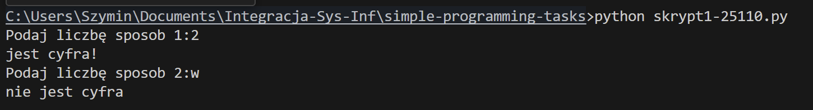

---

**Skrypt 2**

Napisz program, który sprawdza czy wczytany łańcuch znakowy jest liczbą lub nie. Muszą być wczytane co najmniej dwa znaki.

**Plik**  
[exercise-02](./skrypt2-25110.py)

**Zrzut**  
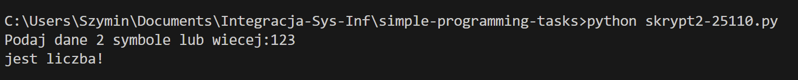

---

**Skrypt 3**

Napisz program, który szuka określonego ciągu znaków w łańcuchu znakowym i zwraca indeks pierwszego wystąpienia ciągu lub -1, gdy nie ma takiego ciągu.

**Plik**  
[exercise-03](./skrypt3-25110.py)

**Zrzut**  
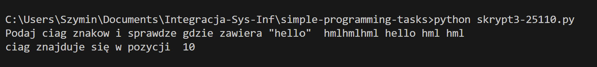

---

**Skrypt 4**

Napisz program, który szuka określonego ciągu znaków w łańcuchu znakowym i zwraca indeksy wszystkich wystąpień ciągu lub -1, gdy nie ma takiego ciągu.

**Plik**  
[exercise-04](./skrypt4-25110.py)

**Zrzut**  
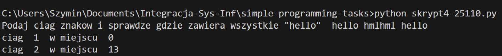

---

**Skrypt 5**

Napisz program (na dwa sposoby), który szuka pierwiastków liczb od 1 do 256 (włącznie) podzielnych bez reszty przez 2.

**Plik**  
[exercise-05](./skrypt5-25110.py)

**Zrzut**  
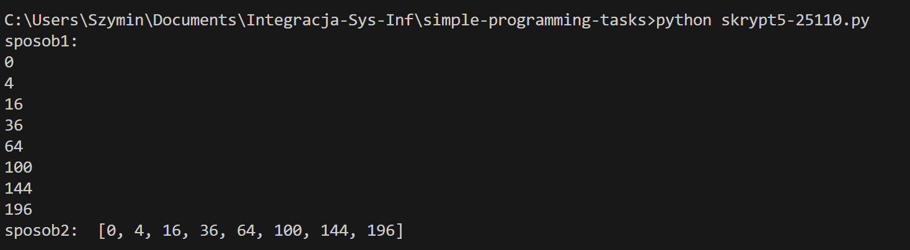

---

**Skrypt 6**

Napisz program, który tworzy słownik o nazwie zawierającej Twój numer albumu. Kluczami powinny być liczby od 10 do 20, a wartościami pseudolosowe łańcuchy znaków o długości 8.

**Plik**  
[exercise-06](./skrypt6-25110.py)

**Zrzut**  
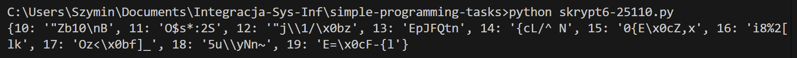

---

**Skrypt 7**

Stwórz folder `utils`, a w nim plik `obliczenia.py` z czterema funkcjami matematycznymi z modułu `math`. Zaimportuj je w `skrypt7-25110.py`.

**Pliki**  
[utils/obliczenia.py](./utils/obliczenia.py)  
[exercise-07](./skrypt7-25110.py)

**Zrzut**  
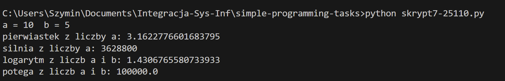

---

**Skrypt 8**

Napisz program, który generuje losowy ciąg znaków o długości 100 i tworzy słownik z unikalnymi znakami i liczbą ich wystąpień. Utwórz listę tupli (znak, liczba).

**Plik**  
[exercise-08](./skrypt8-25110.py)

**Zrzut**  
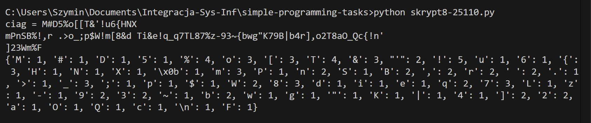

---

**Skrypt 9**

Stwórz klasy `Vehicle` i `Car` oraz metody `is_old()` i `is_long_mileage()`. Wykorzystaj dekorator `@property`.

**Plik**  
[exercise-09](./skrypt9-25110.py)

**Zrzut**  
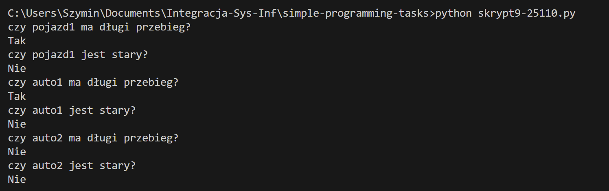

---

**Skrypt 10**

Wygeneruj alfabet 'a' do 'z' i zapisz go do dwóch plików: jeden w jednej linii, drugi z literami w osobnych liniach.

**Plik**  
[exercise-10](./skrypt10-25110.py)

**Zrzut**  
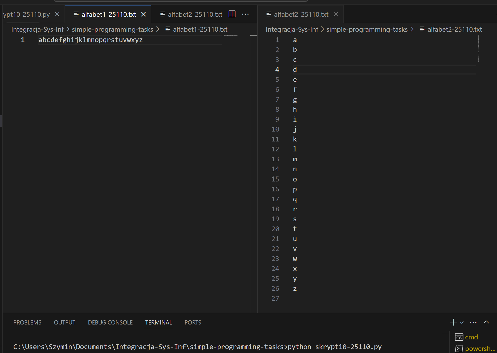

---

**Skrypt 11**

Odwróć sentencję podaną przez użytkownika.

**Plik**  
[exercise-11](./skrypt11-25110.py)

**Zrzut**  
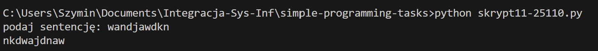

---

**Skrypt 12**

Zamień wszystkie litery 'o' na '0', 'e' na '3', 'i' na '1', 'a' na '4' w podanej sentencji.

**Plik**  
[exercise-12](./skrypt12-25110.py)

**Zrzut**  
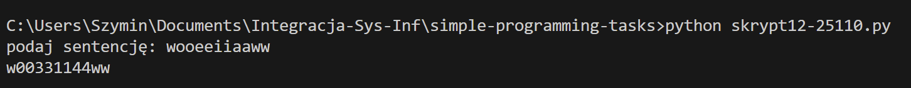

---

**Skrypt 13**

Wyświetl liczby od 1 do 50 z pominięciem liczb podzielnych przez 3.

**Plik**  
[exercise-13](./skrypt13-25110.py)

**Zrzut**  
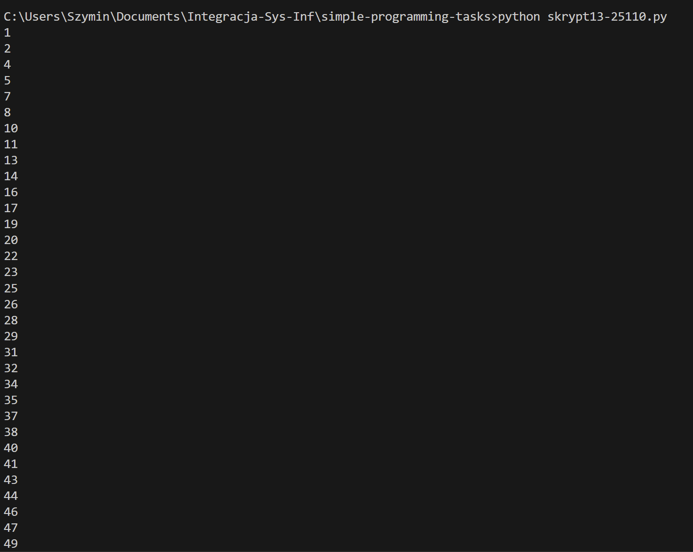

---

---

**Skrypt 14**

Wyświetl liczby w przedziale od 1 do 100 podzielne przez 3 i 4 oraz podaj ich liczbę.

**Plik**  
[exercise-14](./skrypt14-25110.py)

**Zrzut**  
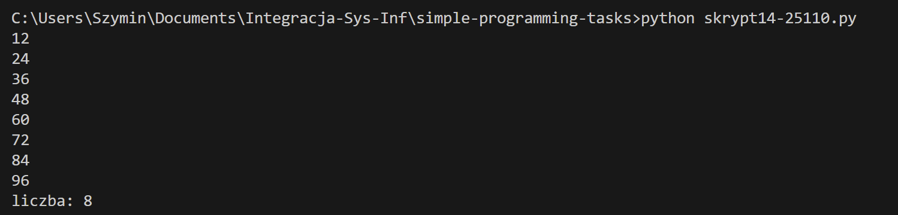

---

**Skrypt 15**

Dodawaj do wcześniej zadeklarowanej tabeli liczby z przedziału od 1 do 100, które są podzielne przez 3 lub 5.

**Plik**  
[exercise-15](./skrypt15-25110.py)

**Zrzut**  
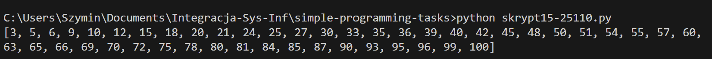

---

**Skrypt 16**

Napisz prostą funkcję o nazwie `potega()`, która podnosi liczbę do trzeciej potęgi.

**Plik**  
[exercise-16](./skrypt16-25110.py)

**Zrzut**  
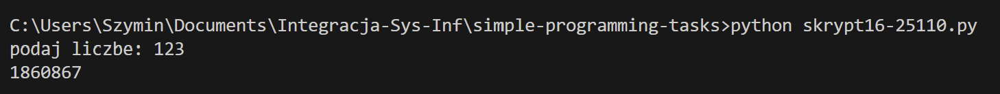

---

**Skrypt 17**

Stwórz klasę `Dog` z polami `name`, `age`, `coat_color` oraz metodą `sound()` wypisującą `{name} is barking!`. Stwórz 3 obiekty klasy.

**Plik**  
[exercise-17](./skrypt17-25110.py)

**Zrzut**  
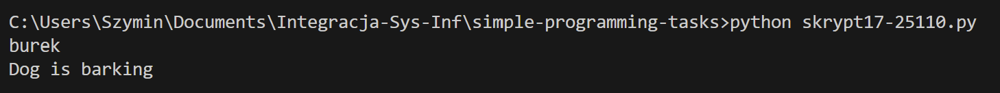

---

**Skrypt 18**

Stwórz plik `funkcje.py` z funkcjami: dodawanie, odejmowanie, dzielenie, mnożenie oraz modulo. W pliku `main.py` zaimportuj i użyj tych funkcji.

**Pliki**  
[funkcje.py](./funkcje.py)  
[main.py](./main.py)

**Zrzut**  
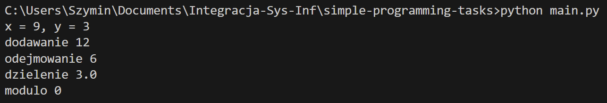

---

**Skrypt 19**

Sprawdź, czy wyraz lub zdanie podane przez użytkownika jest palindromem.

**Plik**  
[exercise-19](./skrypt19-25110.py)

**Zrzut**  
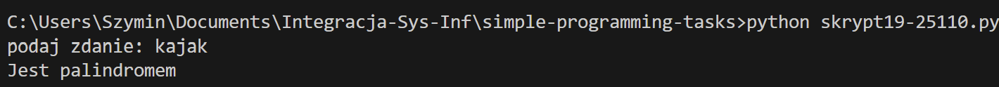

---

**Skrypt 20**

Prosta gra – program generuje losową liczbę od 1 do 100, użytkownik odgaduje z podpowiedzią czy za mała/duża.

**Plik**  
[exercise-20](./skrypt20-25110.py)

**Zrzut**  
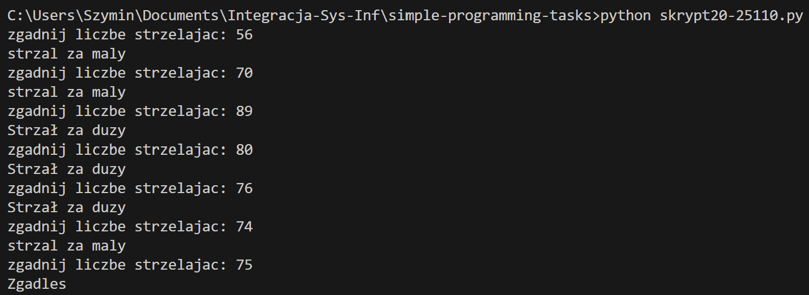

---

**Skrypt 21**

Dziedziczenie klas: `Animal` z `name`, `age`, `sex` i metodą `sound()`. Klasy `Dog`, `Cat`, `Fox` dziedziczą i nadpisują `sound()`. `Dog` i `Cat` mają też `breed`.

**Plik**  
[exercise-21](./skrypt21-25110.py)

**Zrzut**  
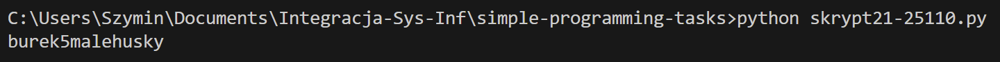

---

**Skrypt 22**

Użyj pliku `wordlist_10000.txt` i napisz funkcje wyszukujące najdłuższy wyraz oraz wyrazy o długości 10.

**Plik**  
[exercise-22](./skrypt22-25110.py)

**Zrzut**  
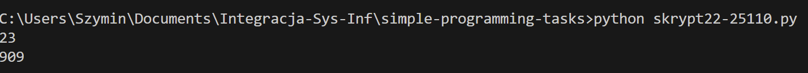

---

**Skrypt 23**

Za pomocą pętli wygeneruj 1000 losowych 6-znakowych wyrazów z [A-Z][a-z][0-9] i zapisz do pliku `passwords.txt`.

**Plik**  
[exercise-23](./skrypt23-25110.py)

**Zrzut**  
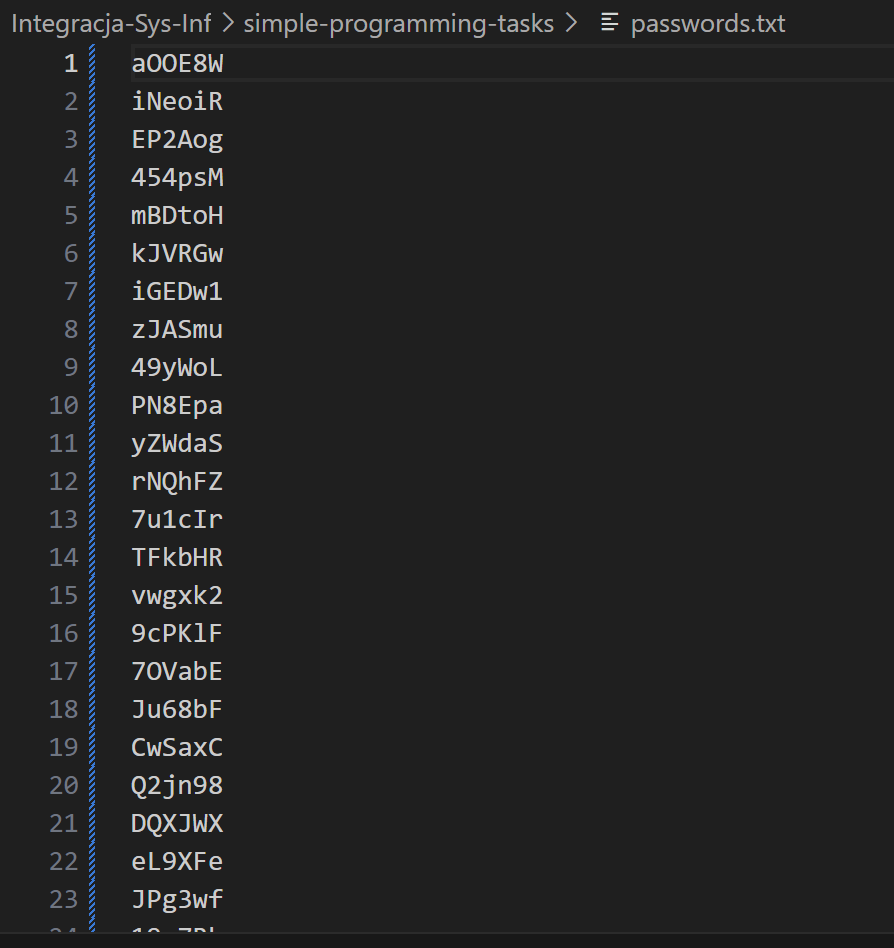

---

**Skrypt 24**

Funkcja tworząca plik `pc.csv` z kolumnami `pc_name`, `ip`. IP od `172.30.2.1` do `172.30.2.100`. Nazwa komputera zaczyna się od P i 4. oktetu IP.

**Plik**  
[exercise-24](./skrypt24-25110.py)

**Zrzut**  
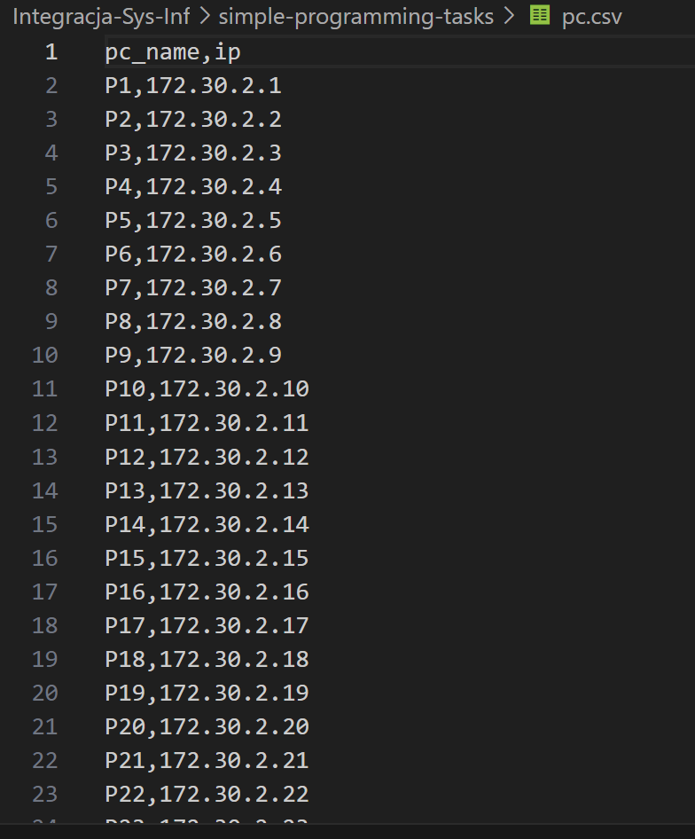

---

**Skrypt 25**

Za pomocą `BeautifulSoup` zapisz do listy wszystkie hiperłącza z wybranej strony internetowej.

**Plik**  
[exercise-25](./skrypt25-25110.py)

**Zrzut**  
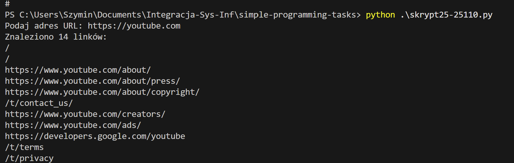

---

**Skrypt 26**

Webscraper pobierający oferty domów z Otodom (Gdynia, max 600k). Każda oferta to obiekt klasy `Home` z `header_name`, `price`, `price_for_m2`. Zapisz do słownika i pliku `home.csv`.

**Plik**  
[exercise-26](./skrypt26-25110.py)

**Zrzut**  

