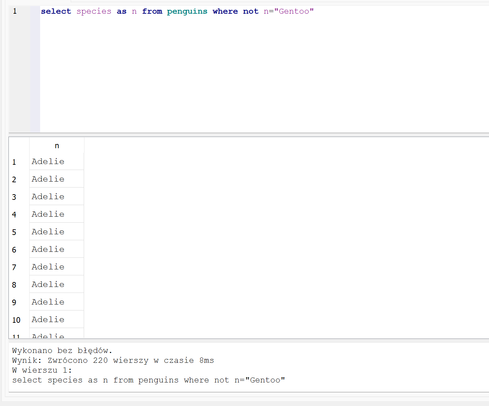

**Zadanie 1**
Write a SQL query to select the sex and body mass columns from the little_penguins in that order, sorted such that the largest body mass appears first.

**Plik**
[exercise-01](./exercise-01.txt)

**Zrzut**

**Zadanie 2**
Write a SQL query to select the islands and species from rows 50 to 60 inclusive of the penguins table. Your result should have 11 rows.

**Plik**
[exercise-02](./exercise-02.txt)

**Zrzut**

**Zadanie 3**
Modify your query to select distinct combinations of island and species from the same rows and compare the result to what you got in part 1.

**Plik**
[exercise-03](./exercise-03.txt)

**Zrzut**

**Zadanie 4**

**Plik**
[exercise-04](./exercise-04.txt)

**Zrzut**

**Zadanie 5**

**Plik**
[exercise-05](./exercise-05.txt)

**Zrzut**

**Zadanie 6**

**Plik**
[exercise-06](./exercise-06.txt)

**Zrzut**

**Zadanie 7**

**Plik**
[exercise-07](./exercise-07.txt)

**Zrzut**

**Zadanie 8**

**Plik**
[exercise-08](./exercise-08.txt)

**Zrzut**

**Zadanie 9**

**Plik**
[exercise-09](./exercise-09.txt)

**Zrzut**

**Zadanie 10**

**Plik**
[exercise-10](./exercise-10.txt)

**Zrzut**

**Zadanie 11**

**Plik**
[exercise-11](./exercise-11.txt)

**Zrzut**

**Zadanie 12**

**Plik**
[exercise-12](./exercise-12.txt)

**Zrzut**

**Zadanie 13**

**Plik**
[exercise-13](./exercise-13.txt)

**Zrzut**

**Zadanie 14**

**Plik**
[exercise-14](./exercise-14.txt)

**Zrzut**

**Zadanie 15**

**Plik**
[exercise-15](./exercise-15.txt)

**Zrzut**

**Zadanie 16**

**Plik**
[exercise-16](./exercise-16.txt)

**Zrzut**

