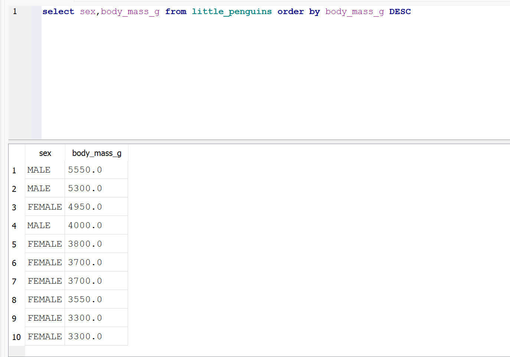

**Zadanie 1**

Write a SQL query to select the sex and body mass columns from the little_penguins in that order, sorted such that the largest body mass appears first.

**Plik**
[exercise-01](./exercise-01.txt)

**Zrzut**

**Zadanie 2**

Write a SQL query to select the islands and species from rows 50 to 60 inclusive of the penguins table. Your result should have 11 rows.

**Plik**
[exercise-02](./exercise-02.txt)

**Zrzut**

**Zadanie 3**

Modify your query to select distinct combinations of island and species from the same rows and compare the result to what you got in part 1.

**Plik**
[exercise-03](./exercise-03.txt)

**Zrzut**

**Zadanie 4**

Write a query to select the body masses from penguins that are less than 3000.0 grams.

**Plik**
[exercise-04](./exercise-04.txt)

**Zrzut**

**Zadanie 5**

Write another query to select the species and sex of penguins that weight less than 3000.0 grams. This shows that the columns displayed and those used in filtering are independent of each other.

**Plik**
[exercise-05](./exercise-05.txt)

**Zrzut**

**Zadanie 6**

Use the not operator to select penguins that are not Gentoos.

**Plik**
[exercise-06](./exercise-06.txt)

**Zrzut**

**Zadanie 7**

SQL's or is an inclusive or: it succeeds if either or both conditions are true. SQL does not provide a specific operator for exclusive or, which is true if either but not both conditions are true, but the same effect can be achieved using and, or, and not. Write a query to select penguins that are female or on Torgersen Island but not both.

**Plik**
[exercise-07](./exercise-07.txt)

**Zrzut**

**Zadanie 8**

A column called what_where that has the species and island of each penguin separated by a single space.

**Plik**
[exercise-08](./exercise-08.txt)

**Zrzut**

**Zadanie 9**

A column called bill_ratio that has the ratio of bill length to bill depth.

**Plik**
[exercise-09](./exercise-09.txt)

**Zrzut**

**Zadanie 10**

Use SQLite's .nullvalue command to change the printed representation of null to the string null and then re-run the previous query. When will displaying null as null be easier to understand? When might it be misleading?

**Plik**
[exercise-10](./exercise-10.txt)

**Zrzut**

**Zadanie 11**

Write a query to find penguins whose body mass is known but whose sex is not.

**Plik**
[exercise-11](./exercise-11.txt)

**Zrzut**

**Zadanie 12**

Write another query to find penguins whose sex is known but whose body mass is not.

**Plik**
[exercise-12](./exercise-12.txt)

**Zrzut**

**Zadanie 13**

What is the average body mass of penguins that weight more than 3000.0 grams?

**Plik**
[exercise-13](./exercise-13.txt)

**Zrzut**

**Zadanie 14**

How many different body masses are in the penguins dataset?

**Plik**
[exercise-14](./exercise-14.txt)

**Zrzut**

**Zadanie 15**

Explain why the output of the previous query has a blank line before the rows for female and male penguins.

Write a query that shows each distinct body mass in the penguin dataset and the number of penguins that weigh that muc

**Plik**
[exercise-15](./exercise-15.txt)

**Zrzut**

**Zadanie 16**

Write a query that uses filter to calculate the average body masses of heavy penguins (those over 4500 grams) and light penguins (those under 3500 grams) simultaneously. Is it possible to do this using where instead of filter?

**Plik**
[exercise-16](./exercise-16.txt)

**Zrzut**

**Zadanie 17**

Using an in-memory database, define a table called notes with two text columns author and note and then add three or four rows. Use a query to check that the notes have been stored and that you can (for example) select by author name.

What happens if you try to insert too many or too few values into notes? What happens if you insert a number instead of a string into the note field?

**Plik**
[exercise-17](./exercise-17.txt)

**Zrzut**

**Zadanie 18**

What happens if you try to delete rows that don't exist (e.g., all entries in work that refer to juna)?

**Plik**
[exercise-18](./exercise-18.txt)

**Zrzut**

**Zadanie 19**

Saving and restoring data as text:

1. Re-create the notes table in an in-memory database and then use SQLite's .output and .dump commands to save the database to a file called notes.sql. Inspect the contents of this file: how has your data been stored?

2. Start a fresh SQLite session and load notes.sql using the .read command. Inspect the database using .schema and select *: is everything as you expected?

**Plik**
[exercise-19](./exercise-19.txt)

**Zrzut**

**Zadanie 20**

Saving and restoring data in binary format:

1. Re-create the notes table in an in-memory database once again and use SQLite's .backup command to save it to a file called notes.db. Inspect this file using od -c notes.db or a text editor that can handle binary data: how has your data been stored?

2. Start a fresh SQLite session and load notes.db using the .restore command. Inspect the database using .schema and select *: is everything as you expected?

**Plik**
[exercise-20](./exercise-20.txt)

**Zrzut**

**Zadanie 21**

Re-run the query shown above using where job = name instead of the full table.name notation. Is the shortened form easier or harder to read and more or less likely to cause errors?

**Plik**
[exercise-21](./exercise-21.txt)

**Zrzut**

**Zadanie 22**

Find the least time each person spent on any job. Your output should show that mik and po each spent 0.5 hours on some job. Can you find a way to show the name of the job as well using the SQL you have seen so far?

**Plik**
[exercise-22](./exercise-22.txt)

**Zrzut**

